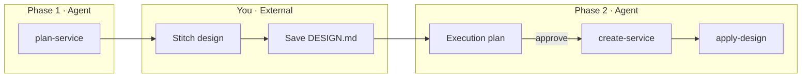

# Factory Workflow

1-blue 서비스를 **전략 → 외부 디자인 → 구현** 순으로 만드는 표준 워크플로입니다.

## Overview



## Phase 1 — Strategy (코드 없음)

**트리거:** "○○ 앱 만들고 싶어", 주제·아이디어 언급

**스킬:** `.cursor/skills/plan-service/`

**Agent가 제공:**

1. slug, name, template type
2. [awesome-design-md](https://github.com/VoltAgent/awesome-design-md) DESIGN.md 추천
3. Stitch copy-paste 프롬프트
4. SEO 롱테일 (title, keywords, FAQ)
5. APP.md 초안
6. 당신이 할 일 + Phase 2 trigger 문장

**Agent가 하지 않음:** `create:app`, 소스 편집, commit

## External — Your work

1. [Google Stitch](https://stitch.withgoogle.com/) (or Figma)에서 UI 생성
2. `apps/web-{slug}/DESIGN.md` 에 Stitch URL + design tokens 저장  
   (create-app **전**에는 메모/별도 파일에 저장해도 됨)
3. APP.md SEO·기능 검토

## Phase 2 — Implementation

**트리거:** "시작 계획 세워줘" → 검토 → "승인" / "진행해줘"

**스킬 순서:**

1. **create-service** — `pnpm create:app`, core logic, APP.md 반영
2. **apply-design** — `_components` UI, `@1-blue/ui`
3. **deploy-vercel** / **add-adsense** — 배포 시 (별도)

**검증:**

```bash
pnpm --filter web-{slug} test
pnpm --filter web-{slug} lint
pnpm --filter web-{slug} typecheck
pnpm --filter web-{slug} build
```

## Cursor skills map

| Skill | Phase |
|-------|-------|
| plan-service | 1 |
| create-service | 2 |
| apply-design | 2 |
| scaffold-web-static | 2 (create:app only) |
| deploy-vercel, add-adsense | post-build |

## Example: date utilities

See `.cursor/skills/plan-service/examples.md` for `days-between` and `date-after-days`.

## Docs

- [MONOREPO.md](./MONOREPO.md)
- [EXTERNAL-CHECKLIST.md](./EXTERNAL-CHECKLIST.md)
