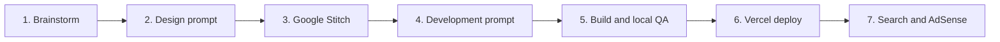

# Factory Workflow

1-blue 서비스를 아이디어에서 검색·광고 등록까지 진행하는 Codex 표준 워크플로다.

## 실행 모드

### 단계형 모드 — 기본

```text
1단계: 기획 → Stitch 프로젝트·디자인 시스템·PC/Tablet/Mobile 화면 → 사용자 확인
2단계: 사용자 승인 → 개발 프롬프트 → 구현 → 로컬 검증
```

별도 지시가 없으면 이 모드를 사용한다. Stitch 결과, 주요 화면, 자체 검토 내용을 보여 준 뒤 구현 전에 기다린다.

### 일괄 모드 — 명시적 요청

사용자가 "한번에", "중간 확인 없이", "디자인부터 구현까지", "끝까지 진행"을 명시하면 다음 흐름을 한 작업으로 연결한다.

```text
기획 → Stitch 생성 → 디자인 자체 검수·수정 → 개발 handoff → 구현 → 로컬 검증
```

일괄 모드에서도 credentials 부족, MCP 권한 오류, 비용·제품 방향을 크게 바꾸는 결정에서는 사용자에게 묻는다. 원격 DB 적용, Vercel 배포, 검색·광고 등록은 최초 요청에 명시되지 않았다면 포함하지 않는다.

예시 명령:

```text
# 단계형
이 아이디어를 기획하고 Stitch에서 PC·Tablet·Mobile 디자인까지 만들어줘.
디자인을 내가 확인한 뒤 구현할게.

# 일괄형
이 아이디어를 기획한 뒤 Stitch 프로젝트와 디자인 시스템을 만들고,
PC·Tablet·Mobile 디자인을 자체 검수해서 로컬 구현·검증까지 한번에 진행해줘.
중간 디자인 확인은 생략해.
```



## 1. 아이디어 선정

`$plan-service`로 다음을 정한다.

- 사용자 문제와 한 줄 가치 제안
- 기존 Factory 앱과의 중복 여부
- 첫 버전 기능과 제외 범위
- 검색 의도, long-tail keyword, FAQ
- `web-static` 또는 `web-api`
- DB, AI API, storage, cron 등 외부 선행 작업

이 단계에서는 scaffold와 소스 수정을 하지 않는다.

## 2. 디자인 프롬프트

`$design-service`로 awesome-design-md의 현재 카탈로그를 확인하고 제품에 맞는 디자인을 선택한다.

- 기본 디자인 한 개와 필요한 경우 보조 디자인 한 개
- raw DESIGN.md URL과 핵심 token
- 실제 한국어 copy와 화면 상태
- 별도 언급이 없으면 PC, Tablet, Mobile 전체
- shadcn/ui로 구현 가능한 component
- 접근성과 광고 slot

Codex가 제공한 전체 프롬프트를 Google Stitch에 입력한다.

## 3. Google Stitch

Stitch에서 모든 대상 화면을 생성하고 검토한다.

- 주요 route별 화면
- loading, empty, error, success 상태
- PC, Tablet, Mobile layout
- navigation과 footer
- form validation과 긴 콘텐츠

Stitch MCP가 연결되어 있으면 Codex가 project를 생성하고 DESIGN.md 기반 디자인 시스템과 screen을 생성·조회·수정한다. 연결되어 있지 않으면 Stitch URL, screenshot 또는 export를 전달한다.

## 4. 개발 프롬프트

`$design-service`가 전략과 Stitch 결과를 합쳐 구현 handoff를 만든다.

- APP.md 제품 요구사항
- DESIGN.md source와 token
- route 및 공개/noindex 정책
- component 배치와 데이터 상태
- `ROUTES` 상수 요구사항
- server/client 경계
- 외부 선행 작업과 구현 제외 범위

단계형 모드는 개발 handoff를 보여 주고 사용자 승인을 기다린다. 일괄 모드는 Stitch 결과를 자체 검수한 뒤 구현으로 이어간다. 중요한 제품 결정이 남아 있으면 어느 모드에서도 구현으로 넘어가지 않는다.

## 5. 구현과 로컬 확인

`$build-service`로 승인된 개발 프롬프트를 구현한다.

1. `pnpm create:app`으로 template 생성
2. route 가까이에 component, hook, util 배치
3. 앱 전용 domain logic은 앱 `src/core`에 배치
4. 앱 `src/app/_constants/routes.ts`에서 경로 관리
5. 필요한 경우 `$manage-supabase-schema` 실행
6. UI, SEO, legal, sitemap, robots 구현
7. test, lint, typecheck, build 실행
8. 브라우저에서 PC, Tablet, Mobile 비교 확인
9. `$write-app-readme`로 실제 구현 기반 README 작성

검증 실패나 외부 선행 작업이 남아 있으면 배포하지 않는다.

## 6. Vercel 배포

사용자가 명시적으로 요청하면 `$launch-service`를 사용한다.

- project: `ob-{slug}`
- root: `apps/web-{slug}`
- URL: `https://ob-{slug}.vercel.app`
- production env 설정
- health, 주요 route, metadata, robots, sitemap 재검증

로그인, OAuth, 결제, DNS 등 사용자 권한이 필요한 단계는 안내 후 사용자 완료를 기다린다.

## 7. 검색·광고 등록

production 확인 후 다음 순서를 지킨다.

1. Google Search Console property와 sitemap
2. 네이버 Search Advisor 소유권, robots, sitemap
3. Google AdSense site, ads.txt, script, legal page

등록과 심사 대기는 별개다. 결과를 `완료`, `사용자 작업 필요`, `심사 대기`로 구분한다.

## 관련 문서

- [MONOREPO.md](./MONOREPO.md)
- [ARCHITECTURE.md](./ARCHITECTURE.md)
- [ROUTING.md](./ROUTING.md)
- [EXTERNAL-CHECKLIST.md](./EXTERNAL-CHECKLIST.md)
